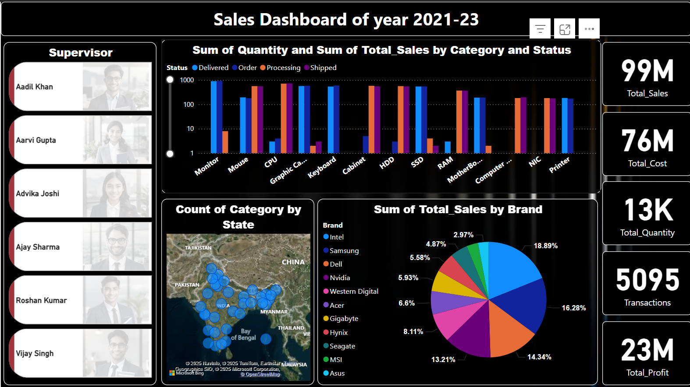
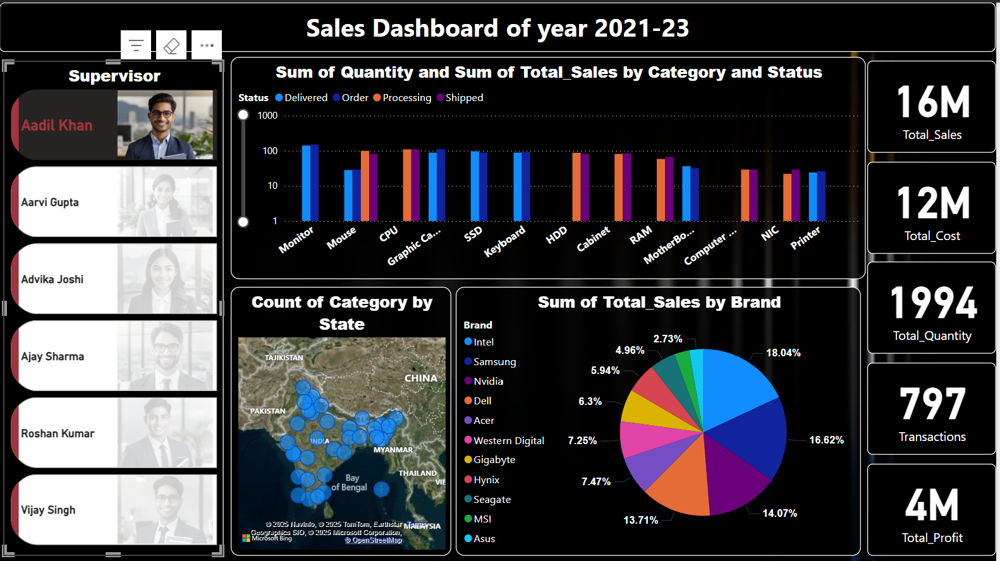

# 📊 Annual Sales Dashboard of Electronics Company (2021–2023)

## 🚀 Project Overview  
Excited to share my latest Power BI project: **"Sales Dashboard of XYZ Company 2021–2023"** – a dynamic, interactive dashboard designed to deliver deep insights into sales performance over the last three years.
## 📸 Dashboard Previews

### 🔷 Sales Overview Page  

### 👨‍💼 Supervisors Overview  

This project provides a comprehensive view of:
- 📈 Revenue trends
- 🛒 Product-level sales analysis
- 🌍 Region-wise performance breakdowns

By leveraging **Power BI’s advanced visualization and data modeling features**, the dashboard empowers stakeholders to make **informed decisions**, drive **strategic planning**, and uncover **opportunities for growth and optimization**.

---

## 🎯 Project Objectives

- Provide real-time, intuitive insights into key sales KPIs
- Support management in identifying high-performing products and regions
- Enable data-driven planning across departments like sales, marketing, and operations

---

## 💡 Key Features

- **Revenue Trend Analysis (2021–2023)**  
- **Product Performance Overview** – top sellers, underperformers  
- **Regional Sales Breakdown** – by country, state, or city  
- **Interactive Filters & Tooltips** for enhanced user experience  
- **Data Modeling & DAX Measures** for calculated insights  

---

## 📌 Tools & Technologies Used

- **Power BI Desktop**  
- **DAX (Data Analysis Expressions)**  
- **Data Cleaning & Transformation** (Power Query)  
- **Excel** (initial data structure)  

---

## 📈 Business Impact

This dashboard is built to:
- Improve **sales efficiency** and **targeted decision-making**
- Uncover growth patterns and address bottlenecks
- Strengthen overall **sales management strategy**

---

